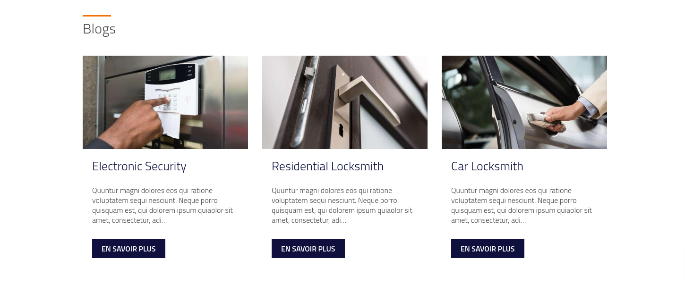

# Presentation

This is an installation guide for the Bibliothèque_numérique theme (Drupal 10). This document will guide you through installing the theme from scratch on your server. This documentation will also help you manage different parts of the website backend and manage your website content using this theme.

## A quick refresher

Throughout this guide we'll be using terms such as sections, layouts, buttons, etc., so it's important that you understand this right away.

### Sections

A section is a block that represents or highlights information. It occupies the entire width of the page. On a home page, for example, you might have several sections: a section for presenting summaries of the different services, a section for displaying the blog summary, a section containing a contact form, and so on.

##### Example: 1

<figure class="figure">
  
  <figcaption class="figure-caption"> Section representing summaries of the latest blog posts </figcaption>
</figure>

##### Example: 2

<figure class="figure">
  
  <figcaption class="figure-caption"> Section representing service summaries </figcaption>
</figure>

### Layout

A layout is a graphical arrangement of elements such as title, description, images, icons, etc. From a Drupal point of view, a layout can be a fairly simple element such as a button or a fairly complicated structure such as a Section , a slideshow (slider)...
