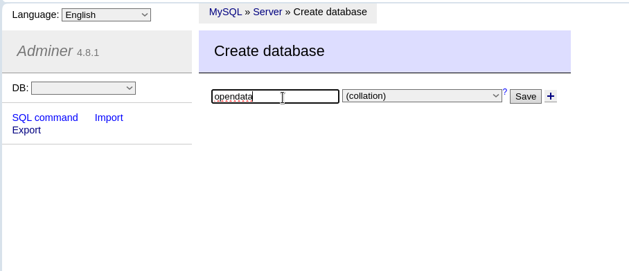
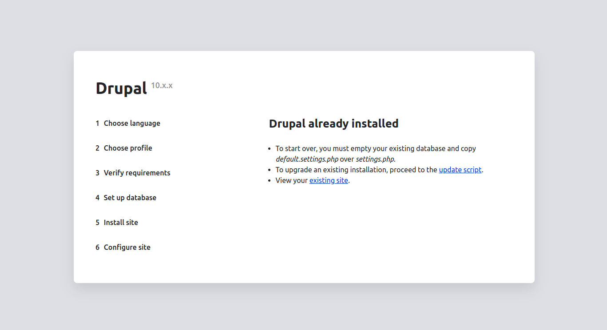

# installation

### requirements

<i> you should first make sure your environment is up to date by following your Drupal 9 or 10 distrubution.
If you are new to Drupal, please take a look at the system requirements on drupal.org
PHP 8.1 or higher MySQL 5.7.8, or, higher, node 20, npm 10
For the Drupal environment, see the recommended configuration (opens new window). We also recommend that you use composer to manage file downloads (core, modules and themes) and updates. </i>

## Introduction

In this section we'll look at how to install the website from scratch.

## Process

The installation package consists of the complete Drupal site with the theme, various modules, sample content and is excellent for beginners to explore the back-end settings and sample content. Installing the demo theme is just like installing Drupal, but you will have the full demo website installed on your server.
Localhost installation: Create a new folder in the htdocs folder for Xampp (www folder for Wamp) or on linux simply create a "siteweb" folder at the root of your computer. Unzip all the files and folders in the demo theme into the folder you have just created and open the demo folder.

The basic data for installation is in the file "opendata/new-installation/opendata.sql.gz", copy the contents and unzip it into the root folder of your hosting. (As a general rule, this is the public_html folder or the parent folder of your site, but if you have any doubts please ask your web host). Next, open a browser and enter the domain name, for example http://opendata.com.

The site installation page will load and you will be asked to select the Language.
<figure class="figure">
  
  <figcaption class="figure-caption"> Chose language </figcaption>
</figure>
The next step is to configure the database:
<figure class="figure">
  
  <figcaption class="figure-caption"> Database connection settings </figcaption>
</figure>

We will then create a database in our database manager (example: adminer) and import the database downloaded from "opendata/new-installation/opendata.sql.gz"

<figure class="figure">
  
  <figcaption class="figure-caption"> database </figcaption>
</figure>

The next step is to install the modules automatically:

<figure class="figure">
  
  <figcaption class="figure-caption"> Installing modules. </figcaption>
</figure>

your installation is complete

<figure class="figure">
  
  <figcaption class="figure-caption"> Basic site configuration. </figcaption>
</figure>

Your website is now ready and all that remains is to update its content according to your data.
If you'd like to find out more about installing drupal, we recommend the [official documentation](https://www.drupal.org/docs/getting-started/installing-drupal).