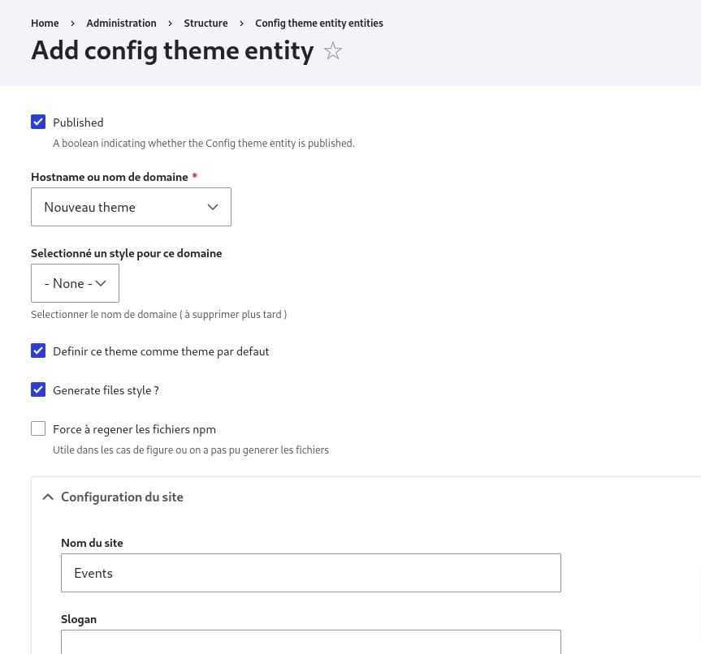

# installation sur un environnement existant

## Introduction

vous disposez deja d'un site web vous souhaitez y ajouter notre theme, cela fait en deux partie l'installation du theme et afin l'installation des modules. (il est important de respecter cette ordre)
 
NB: vous devez au prealable vous rassurer que votre environnement est à jour en suivant votre distrubution Drupal 9 ou 10.

## Processus

Les modules donc vous avez besoin sont dans "old-installation/modules/custom/", transferez son contenu sur votre environnement dans le dossier "modules/custom/". Pour les themes, ils sont dans "old-installation/themes/custom", transferez son contenu vers votre environnement dans le dossier "themes/custom/". 
Pour l'installation du theme, dirigez vous sur structure > apparence, ensuite installé le theme : "habeukevent" (il installera ses dependances de maniere automatique).
( il faut une image illustrative). 
Pour l'installation des modules, diriger vous sur structure > extends, ensuite installé le module "bestlayouts", il selectionnera automatiquement tous les modules donc il a besoin pour functionner.
( il faut deux images qui illustre cela ).
 

### Generer votre theme

Vous devez generer votre theme. Cela vous permet de definir les couleurs, taille de polices et bien d'autre.
allez sur structure > Creation/MAJ du styles des themes, ensuite cliquez sur " + Add Config theme entity ":

<figure class="figure">
  
  <figcaption class="figure-caption"> Generation de votre theme </figcaption>
</figure>
( L'utilisateur doit avoi la possibilité de generer un theme ou pas en function de son env, on doit fournir un theme generer ). 
( il ya aussi des petits bug lors de la creation d'un model de theme ).  
( il faudra egalement installer wbu-atomique dans librarie ).  
( il faudra ajouter un module de transliteration des fichiers dans le coeur ).  
( l'accordeon doit etre par defaut sur dynamique content )  
Une foix cela effectué, VOUS DEVEZ ABSOLUMENT configurer votre site. Voir la section sur <strong>Gestion du contenu</strong>.
