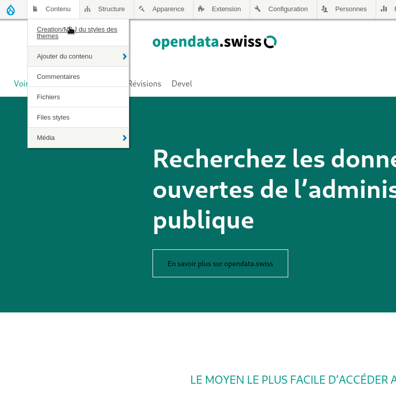
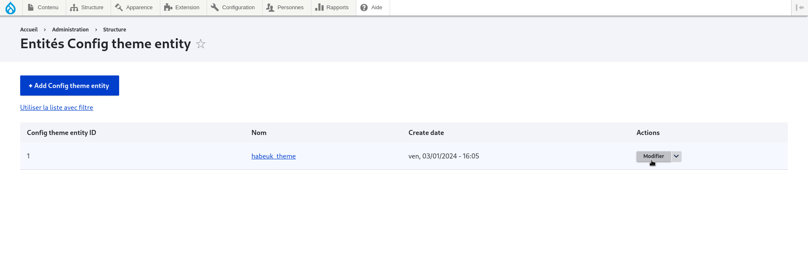
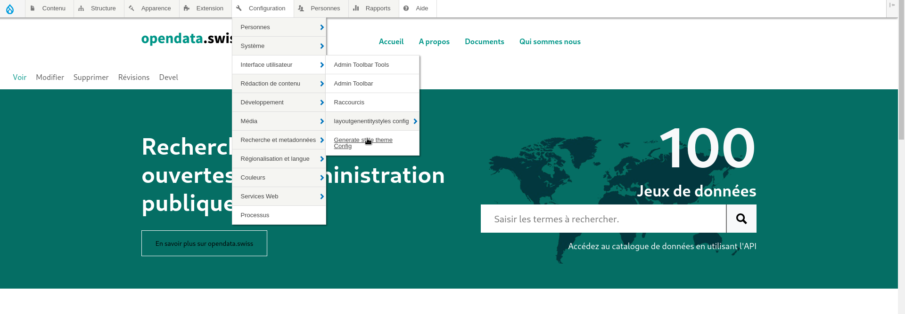
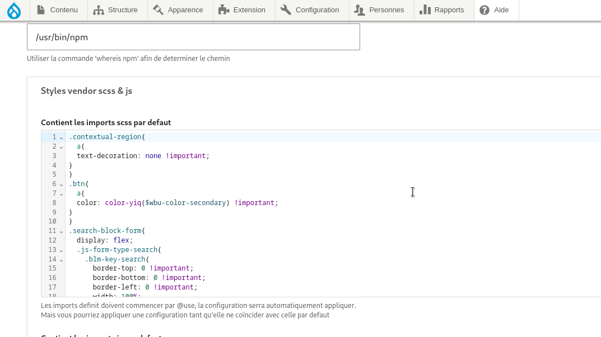

### theme modification or theme regeneration 

To modify the theme, simply go to content for theme style "creation/update".

<figure class="figure">
  
  <figcaption class="figure-caption"> page de configuration du layout </figcaption>
</figure>

then we select our configuration and make some changes, then we save the configuration.

<figure class="figure">
  
  <figcaption class="figure-caption"> page de configuration du layout </figcaption>
</figure>

### modifying theme styles

to modify our theme styles, go to "configuration / user interface / generate style theme config"

<figure class="figure">
  
  <figcaption class="figure-caption"> page de configuration du layout </figcaption>
</figure>

Then we modify the styles in the zone named scss

<figure class="figure">
  
  <figcaption class="figure-caption"> page de configuration du layout </figcaption>
</figure>

<i> each time you modify the styles, you'll have to regenerate the theme </i>

