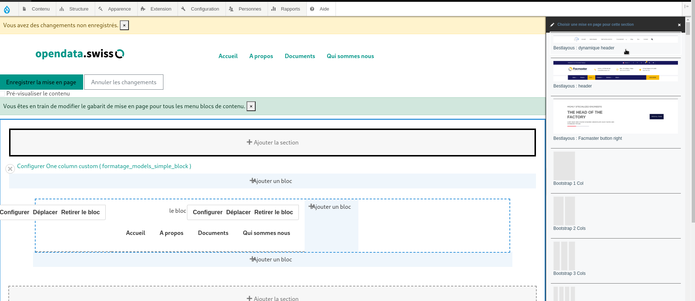
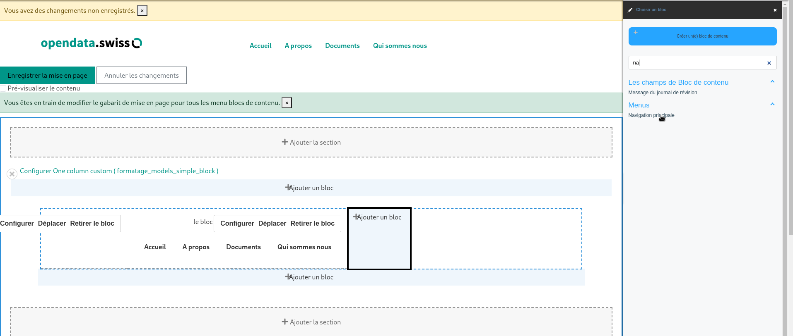
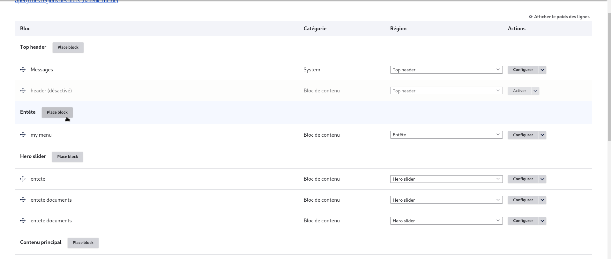
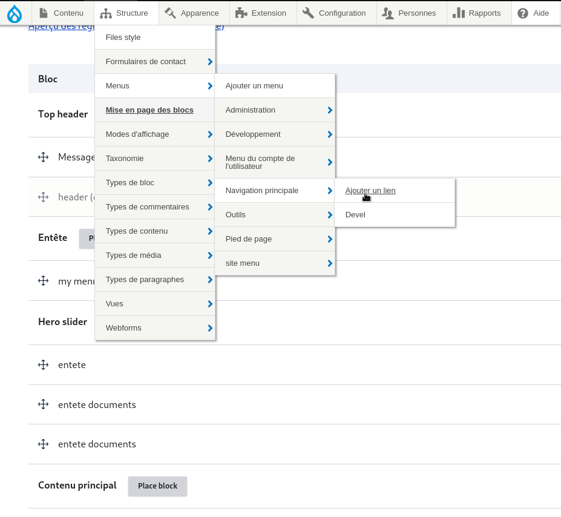

## Process

creating a menu involves several steps, as follows (there are two methods, but we've decided to choose the one below)

### creating a block

We'll start by creating a block in "structure > block > add block", which will manage the display of fields, then click on add block and add a layout (Bestlayous: dynamic header).

<figure class="figure">
  
  <figcaption class="figure-caption"> page de configuration du layout </figcaption>
</figure>

inside our layout we'll place our main navigation block (which is responsible for displaying links)

<figure class="figure">
  
  <figcaption class="figure-caption"> page de configuration du layout </figcaption>
</figure>

### block layout

To position our menu on the site, we'll first give it a fixed place as follows
structure > block > layout
then place our block in the desired area (e.g. header)
then we cofigure our block

<figure class="figure">
  
  <figcaption class="figure-caption"> page de configuration du layout </figcaption>
</figure>

### l'ajout des liens

to add links to our menu go to structure > menu > main navigation and add links

<figure class="figure">
  
  <figcaption class="figure-caption"> page de configuration du layout </figcaption>
</figure>

