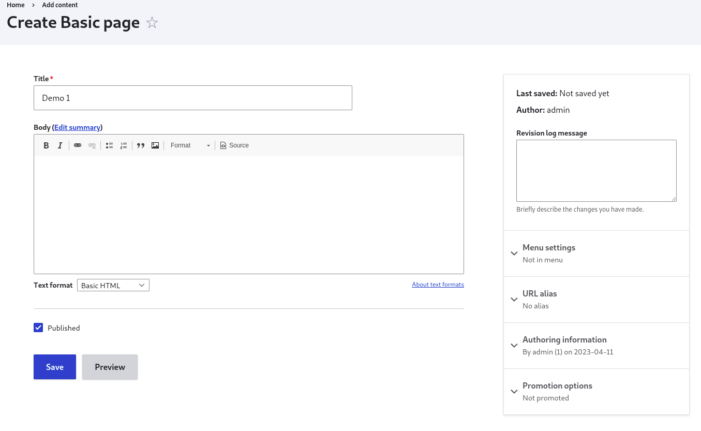

# Sections

## Creating a section

To create a section, we follow the logic below: We create a paragraph that will act as the basic model, then we associate this paragraph with the entity that will display it.

To achieve this, we'll create a page called demo1:

To create the page, go to "content > Add content > Basic page" add page:
<figure class="figure" >
  
  <figcaption class="figure-caption"> Creation de la page basique </figcaption>
</figure>

then in "structure > content type > basic page" we'll create a pargraph field to allow all our basic pages to display paragraphs.

<figure class="figure" >
  
  <figcaption class="figure-caption"> Creation de la page basique </figcaption>
</figure>
