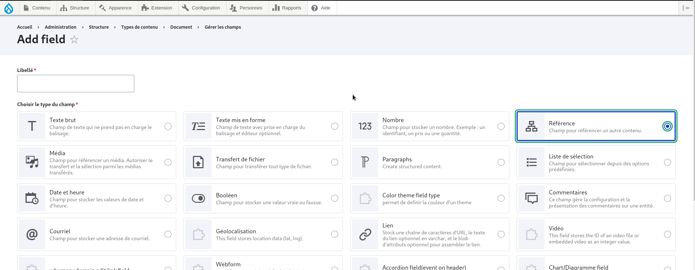
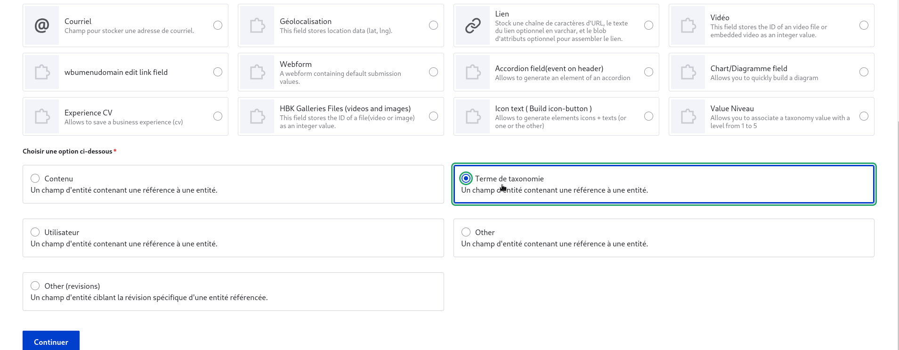

## document creation

to create a document go to structure then content type create a content type named documents then according to the taxonomies already created create chapter types referring to an entity

<figure class="figure" >
  
  <figcaption class="figure-caption"> on se rend dans taxonomies </figcaption>
</figure>

then select taxonomy

<figure class="figure" >
  
  <figcaption class="figure-caption"> on selection ajouter un vocabulaire</figcaption>
</figure>

then configure the layout

## Adding documents

to add a document go to structure / document content 

<figure class="figure" >
  
  <figcaption class="figure-caption"> on selection ajouter un vocabulaire</figcaption>
</figure>

and add a new document

<figure class="figure" >
  
  <figcaption class="figure-caption"> on selection ajouter un vocabulaire</figcaption>
</figure>