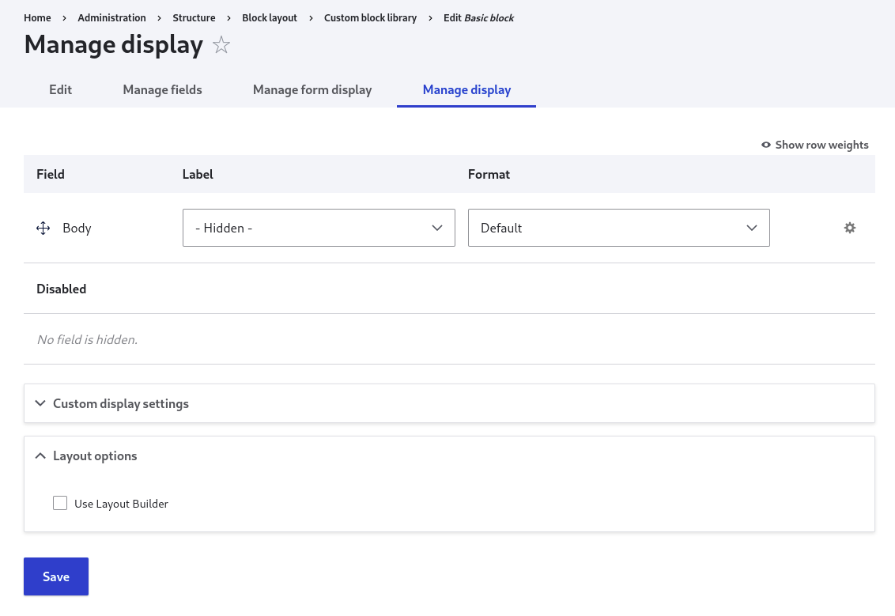
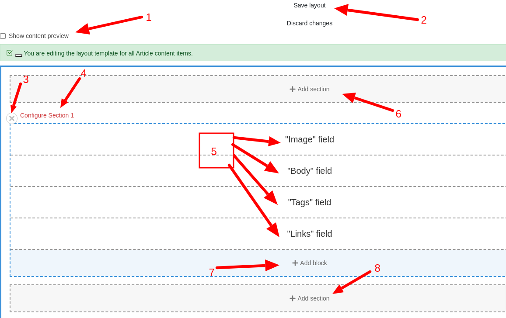
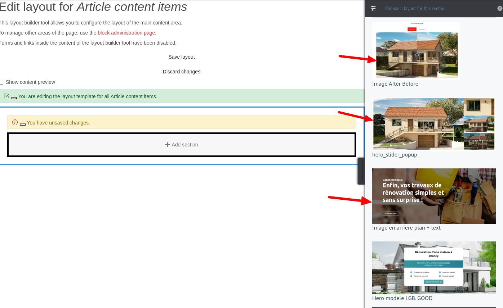
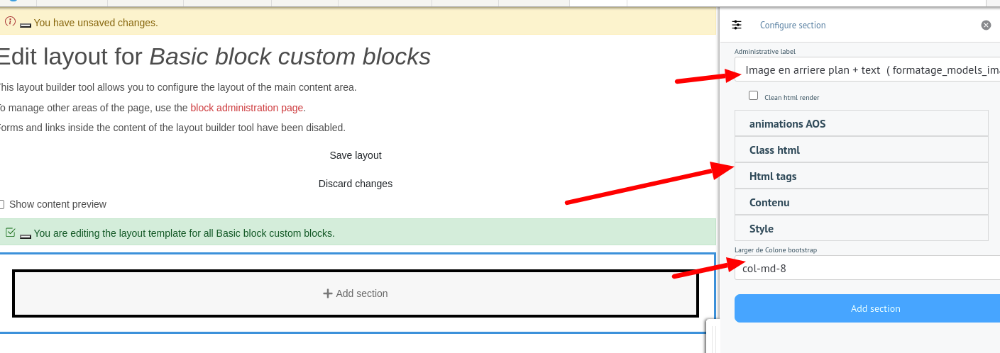

<i> This part is intended for those who wish to go a little further with Drupal, as it requires a basic knowledge of the Drupal eco-system (entities, nodes, taxonomies, etc.). </i>

# Setting up a layout.

A layout can be created for any Drupal entity. Some entities may require a little more effort to achieve, but the most commonly used entities are already pre-configured ( user, articles, pages, taxonomies, custom blocks ).

## Process

Creating a layout involves 4 phases:

<ol>
  <li> identifying the entity to be used </li>
  <li> filling in chmps </li>
  <li> Layout configuration </li>
  <li>Displaying our layout </li>
</ol>

## identifying the entity to be used

Depending on your needs, you need to be able to determine which entity is best suited to your situation. If you want to configure the user page, then the user entity is appropriate, or if you want to add a section to a certain page, then block custom is more appropriate.

## Layout configuration

Layout configuration is performed in the "display management" tab:

<figure class="figure">
  
  <figcaption class="figure-caption"> page de configuration du layout </figcaption>
</figure>

Check the "Use Layout Builder" field and you will see the screenshot below:

<figure class="figure">
  
  <figcaption class="figure-caption"> page de configuration du layout </figcaption>
</figure>

Then click on "Manage layout":

<figure class="figure">
  
  <figcaption class="figure-caption"> page de configuration du layout </figcaption>
</figure>
We advise you to uncheck "Show content preview".

<figure class="figure">
  
  <figcaption class="figure-caption"> Presentation de la page de configuration du layout </figcaption>
</figure>

### Explained

<ol>
  <li> Display content or fields (preferably unchecked)</li>
  <li> Enables backup </li>
  <li> Delete layout </li>
  <li> Displays the layout configuration form. </li>
  <li> These are the fields of your entity </li>
  <li> Adds another layout on top of the current one. </li>
  <li> Add a field from your entity or another resource. </li>
  <li> Adds another layout below the current one. </li>
</ol>

In general, you should delete the default layout and choose a more suitable model. Click on the cross (arrow 3) to confirm deletion.
Then click on "add section":

<figure class="figure" >
  
  <figcaption class="figure-caption"> Presentation de la page de configuration du layout </figcaption>
</figure>

Select the layout you are interested in and then click on "Add section".
<figure class="figure" >
  
  <figcaption class="figure-caption"> Presentation de la page de configuration du layout </figcaption>
</figure>

## Displaying our layout

The display of a layout depends mainly on the structure of the entity. For entities with rendering routes (nodes), you can directly visualize the result through content. For entities without rendering routes (custom blocks), you need to go to "block layout" to select the block and choose a region in which to display it.
