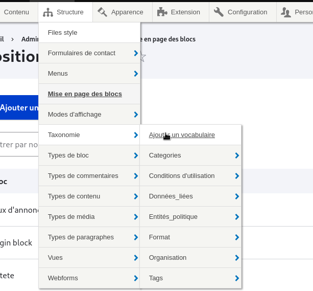
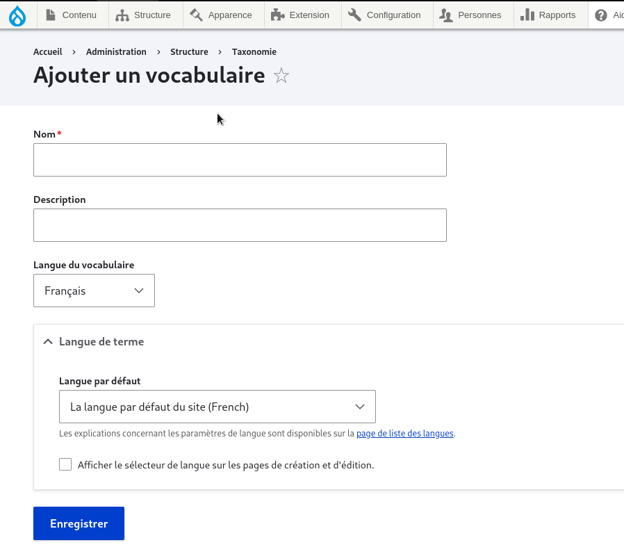
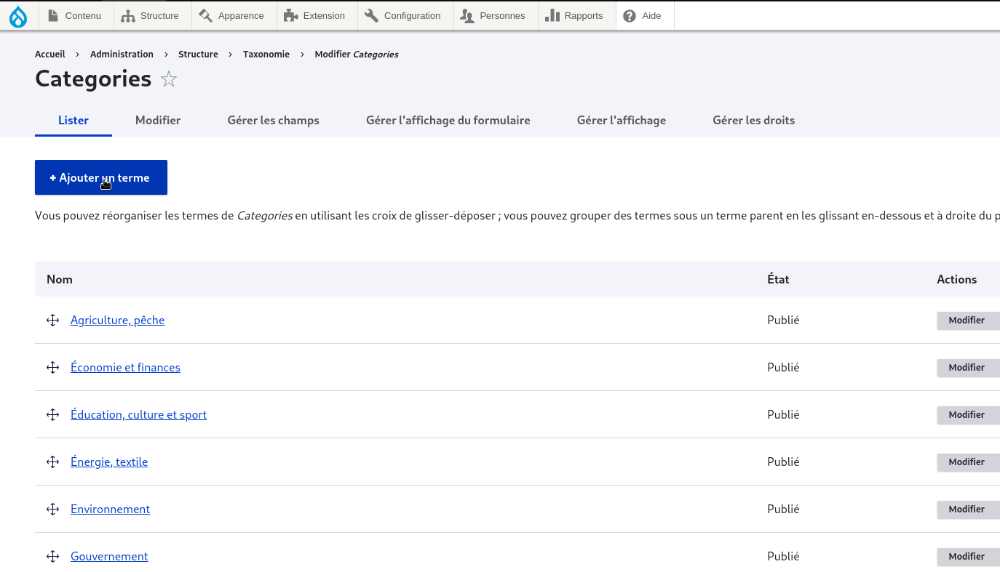
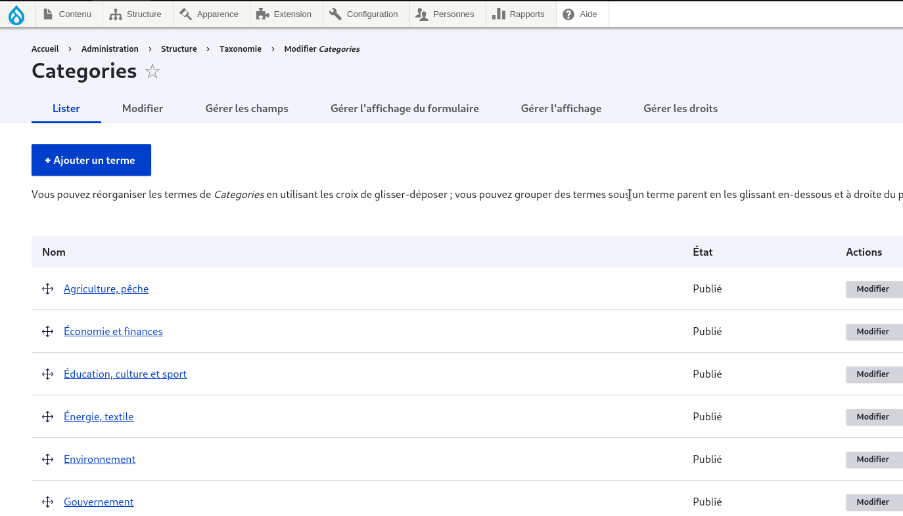

# Adding taxonomies

to create a taxonomy go to "structure > taxonomies" and add a new vocabulary (e.g. categories)
<figure class="figure" >
  
  <figcaption class="figure-caption"> on se rend dans taxonomies </figcaption>
</figure>

Select Add Vocabulary

<figure class="figure" >
  
  <figcaption class="figure-caption"> on selection ajouter un vocabulaire</figcaption>
</figure>

We list its terms

<figure class="figure" >
  
  <figcaption class="figure-caption"> et on liste ses termes </figcaption>
</figure>

## categories

the elements of the category are terms from the categories vocabulary (e.g.: for a site that talks about relief, the terms in our categories will be *savane *steppe *montagne...).

<figure class="figure" >
  
  <figcaption class="figure-caption"> creation des termes </figcaption>
</figure>

